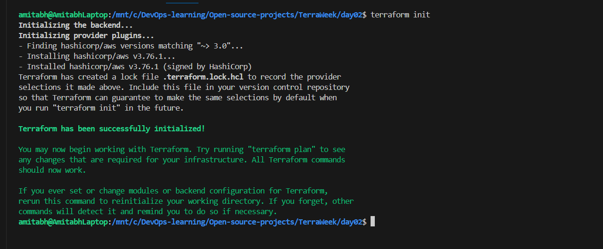
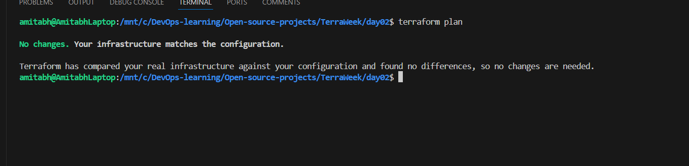
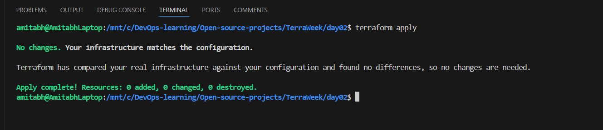

# TerraWeek Day 2


## Task 1: Familiarize yourself with HCL syntax used in Terraform
HCL (HashiCorp Configuration Language) is used to define infrastructure in Terraform. Here are the key components:

- **Blocks**: These define a configuration in Terraform, e.g., `resource`, `provider`, `output`.
  Example:
  ```hcl
  resource "aws_s3_bucket" "example" {
    bucket = "my-unique-bucket-name"
  }
  ```
- **Parameters**: These define values within a block, e.g., `bucket`.
- **Arguments**: These are the specific values provided to parameters. For example, `"my-unique-bucket-name"` is an argument for the `bucket` parameter.

**Resources** in Terraform represent infrastructure objects like instances, buckets, and databases. **Data sources** fetch information about existing infrastructure, such as querying for AWS instance details.

## Task 2: Understand variables, data types, and expressions in HCL
- **Variables**: Variables allow you to reuse configuration and pass values dynamically. Define a variable in `variables.tf`.
  
  Example of a `variables.tf`:
  ```hcl
  variable "bucket_name" {
    description = "The name of the S3 bucket"
    type        = string
    default     = "my-default-bucket"
  }
  ```

- **Use the variable in `main.tf`**:
  ```hcl
  resource "aws_s3_bucket" "example" {
    bucket = var.bucket_name
  }
  ```

## Task 3: Practice writing Terraform configurations using HCL syntax
- **Required Providers**: In your `main.tf`, specify providers such as Docker or AWS.
  Example:
  ```hcl
  terraform {
    required_providers {
      aws = {
        source = "hashicorp/aws"
        version = "~> 3.0"
      }
    }
  }
  ```

- **Testing Configuration**: To test the configuration:
  1. Initialize the Terraform working directory:
     ```bash
     terraform init
     ```

     


  2. Run a plan to check for errors and preview changes:
     ```bash
     terraform plan
     ```

     


  3. Apply the configuration:
     ```bash
     terraform apply
     ```

     


  4. If necessary, adjust the configuration and reapply.


## Example of a `main.tf` file:
```hcl
terraform {
  required_providers {
    aws = {
      source = "hashicorp/aws"
      version = "~> 3.0"
    }
  }
}

provider "aws" {
  region = "us-west-2"
}

resource "aws_s3_bucket" "example" {
  bucket = var.bucket_name
}
```
