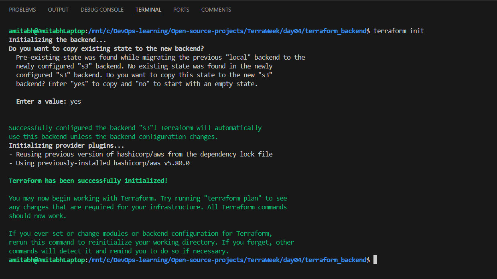
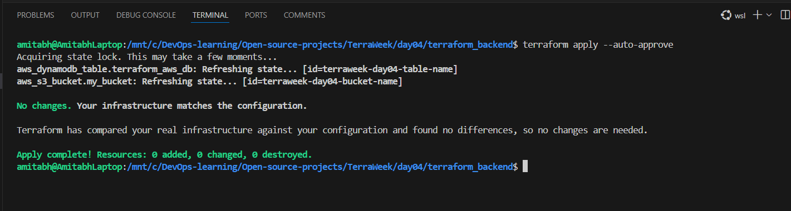

# TerraWeek Day 4 🌱

## Task 1: Importance of Terraform State

📚 **Research**: Dive into the importance of Terraform state in managing infrastructure. Discover how Terraform state helps track the current state of resources and ensures smooth infrastructure provisioning and management.

**Solution :**

### **Terraform State: The Backbone of Infrastructure Management** 🌐

Terraform state is a fundamental component of Terraform's infrastructure as code (IaC) framework. It plays a crucial role in managing and provisioning resources efficiently. Here's an exploration of its importance and functionalities.

---

### **What is Terraform State?**
Terraform state is a file (`terraform.tfstate`) that acts as a **source of truth** for your infrastructure. It records information about all the resources Terraform manages, including their current state and configuration details.

---

### **Why is Terraform State Important?**

1. **Tracking Infrastructure State**  
   Terraform uses the state file to map your configuration files to the real-world infrastructure. Without it, Terraform wouldn’t know which resources it has created, updated, or destroyed.

2. **Efficient Infrastructure Changes**  
   - **Change Detection:** Terraform compares the desired state (defined in configuration files) with the current state (stored in the state file) to detect changes.  
   - **Incremental Updates:** Only resources that require modifications are updated, ensuring faster and safer deployments.

3. **Dependency Management**  
   Terraform uses the state file to determine resource dependencies. This helps maintain the correct order of resource provisioning and destruction.

4. **Supports Collaboration**  
   In team environments, the state file can be stored remotely (e.g., in S3, Azure Storage Account) to allow multiple users to work together. Locking mechanisms ensure no conflicts arise during simultaneous updates.

5. **Backups and Recovery**  
   The state file serves as a backup. In case of accidental changes or failures, it can be used to restore infrastructure to a known state.

---

### **Key Features of Terraform State**

- **Remote State Storage:** Storing the state remotely enables team collaboration and secures critical data. Supported backends include AWS S3, Azure Storage Account, and HashiCorp Consul.  
- **State Locking:** Prevents simultaneous modifications by implementing a locking mechanism.  
- **State Management Commands:**  
  - `terraform state list`: Lists resources in the state.  
  - `terraform state mv`: Moves resources to a new state.  
  - `terraform state rm`: Removes resources from the state.

---

### **Conclusion**
Terraform state is indispensable for maintaining infrastructure consistency, enabling collaborative workflows, and ensuring efficient updates. By understanding its significance and following best practices, you can leverage Terraform’s full potential to manage infrastructure seamlessly.

---

## Task 2: Local State and `terraform state` Command

📚 **Understand**: Explore different methods of storing the state file, such as local or remote storage. Create a simple Terraform configuration file and initialize it to generate a local state file. Get hands-on with the `terraform state` command and learn how to use it effectively to manage and manipulate resources.

**Solution :**

### **Understanding Terraform State Storage**  

Terraform state can be stored either **locally** (on your machine) or **remotely** (on a centralized backend). Choosing between the two depends on the complexity of your infrastructure and team collaboration needs.

---

### **State Storage Methods**

1. **Local State**  
   - Stored as a `terraform.tfstate` file in the working directory by default.  
   - Suitable for small projects or individual use.  
   - Limitations: No collaboration support, risk of accidental loss.  

2. **Remote State**  
   - Stored in cloud services or other backends (e.g., AWS S3, Azure Storage Account, HashiCorp Consul).  
   - Enables collaboration and state locking.  
   - Examples of remote backends:
     - AWS S3 with DynamoDB for locking.
     - Azure Storage Account.
     - HashiCorp Terraform Cloud.

---

### **Hands-On: Local State and `terraform state` Command**

#### **Step 1: Create a Simple Terraform Configuration for s3 bucket**

```hcl
# s3.tf

resource "aws_s3_bucket" "my_bucket" {
  bucket = "terraweek-day04-bucket-name"

  tags = {
    Name = "terraweek-day04-bucket-name"
  }
}
```

---

#### **Step 2: Initialize Terraform**
Run the following command to initialize Terraform and generate the local state file:

```bash
terraform init
```


This creates the `.terraform` directory and prepares the configuration.

---

#### **Step 3: Apply the Configuration**
To provision the S3 bucket and generate the `terraform.tfstate` file, run:

```bash
terraform apply
```


Verify the bucket is created, and check the `terraform.tfstate` file in your working directory.

---

#### **Step 4: Explore the `terraform state` Command**

1. **List All Resources**  
   Display all resources tracked in the state:

   ```bash
   terraform state list
   ```
    
   Output Example:

    


2. **Show Resource Details**  
   Display detailed information about a specific resource:

   ```bash
   terraform state show aws_s3_bucket.my_bucket
   ```

   Output Example:

    

    
3. **Rename a Resource in State**  
   Rename a resource in the state file (useful for resource refactoring):

   ```bash
   terraform state mv aws_s3_bucket.my_bucket aws_s3_bucket.new_example
   ```

   Output Example:

    


4. **Remove a Resource from State**  
   Remove a resource without destroying it (useful for manual management):

   ```bash
   terraform state rm aws_s3_bucket.my_bucket
   ```
   
   Output Example:

    

    


### **Key Takeaways**

- **Local State:** Ideal for individual use, but lacks collaboration and safety features.  
- **Remote State:** Recommended for production environments to enable team collaboration and state security.  
- **terraform state Command:** Provides fine-grained control over state management, essential for handling real-world scenarios like resource renaming or manual imports.

---


## Task 3: Remote State Management

📚 **Explore**: Delve into remote state management options like Terraform Cloud, AWS S3, Azure Storage Account, or HashiCorp Consul. Select one remote state management option and thoroughly research its setup and configuration process. Become familiar with the steps required to leverage remote state management in your Terraform workflow.

**Solution :**

#### **Exploring Options**
1. **Terraform Cloud**:
   - A managed service by HashiCorp.
   - Supports remote state storage, collaboration, and versioning.
   - Includes governance and policy controls.

2. **AWS S3**:
   - A scalable storage option integrated with AWS.
   - Combined with DynamoDB for locking and consistency.
   - Cost-effective and widely adopted in the AWS ecosystem.

3. **Azure Storage Account**:
   - Remote state management for Terraform in Azure.
   - Provides data redundancy and secure access using Azure AD.

4. **HashiCorp Consul**:
   - A distributed key-value store.
   - Used for storing state and enabling service discovery.

---

#### **Why Choose AWS S3 with DynamoDB?**
- **Scalability**: Handles large state files efficiently.
- **Cost-Effectiveness**: Pay for usage only (DynamoDB PAY_PER_REQUEST).
- **Security**: Encryption at rest and in transit.
- **Ecosystem**: Integrates seamlessly with other AWS services.

---

## Task 4: Remote State Configuration

📚 **Modify**: Enhance your Terraform configuration file to store the state remotely using the chosen remote state management option. Include the necessary backend configuration block in your Terraform configuration file to enable seamless remote state storage and access.

```hcl
terraform {
  backend "<chosen_backend>" {
    # Add required configuration options for the chosen backend
  }
}
```

**Solution :**

#### **Enhance Terraform Configuration**

1. **Provision the Remote State Backend Resources**
   Use Terraform to create an S3 bucket and DynamoDB table:

   **`s3.tf`**:
   ```hcl
   resource "aws_s3_bucket" "terraform_state" {
     bucket = var.aws_s3_bucket_name
     versioning {
       enabled = true
     }
     tags = {
       Name = var.aws_s3_bucket_name
     }
   }
   ```

   **`dynamodb.tf`**:
   ```hcl
   resource "aws_dynamodb_table" "terraform_locks" {
     name         = var.aws_dynamodb_table_name
     billing_mode = var.aws_dynamodb_billing_mode
     hash_key     = var.aws_dynamodb_table_haskey

     attribute {
       name = var.aws_dynamodb_table_haskey
       type = "S"
     }

     tags = {
       Name = var.aws_dynamodb_table_name
     }
   }
   ```

   **`variables.tf`**:
   ```hcl
   variable "aws_s3_bucket_name" {
     description = "The name of the S3 bucket for Terraform state."
     default     = "my-terraform-remote-state-bucket"
   }

   variable "aws_dynamodb_table_name" {
     description = "The name of the DynamoDB table for locking."
     default     = "my-terraform-lock-table"
   }

   variable "aws_dynamodb_billing_mode" {
     description = "Billing mode for DynamoDB (e.g., PAY_PER_REQUEST)."
     default     = "PAY_PER_REQUEST"
   }

   variable "aws_dynamodb_table_haskey" {
     description = "Hash key for the DynamoDB table."
     default     = "LockID"
   }
   ```

2. **Update the Backend Configuration**
   Add the backend configuration to your `terraform.tf`:

   **`terraform.tf`**:
   ```hcl
     backend "s3" {
       bucket         = "terraweek-day04-bucket-name"
       key            = "terraform.tfstate"
       region         = "eu-west-1"
       dynamodb_table = "terraweek-day04-table-name"
     }
   ```

3. **Initialize and Apply the Configuration**
   - Initialize Terraform with the backend configuration:
     ```bash
     terraform init
     ```

    Output Example:

    


   - Plan the resource configuration:
     ```bash
     terraform plan
     ```

    Output Example:

    


   - Apply the configuration to provision the resources:
     ```bash
     terraform apply --auto-approve
     ```

    Output Example:

    


4. **Verify Remote State Setup**
   - Confirm the state file exists in the specified S3 bucket.
   - Test locking by running simultaneous `terraform plan` commands from different terminals.

---
