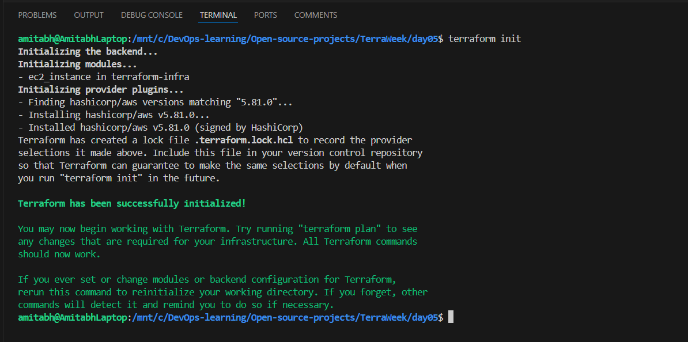
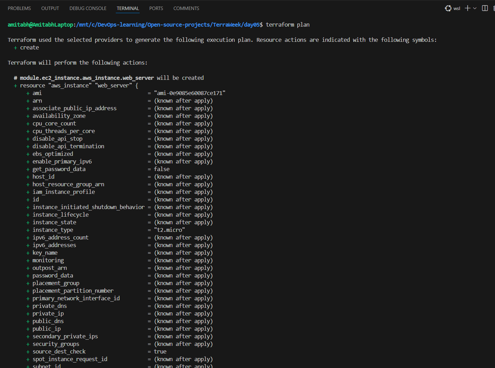
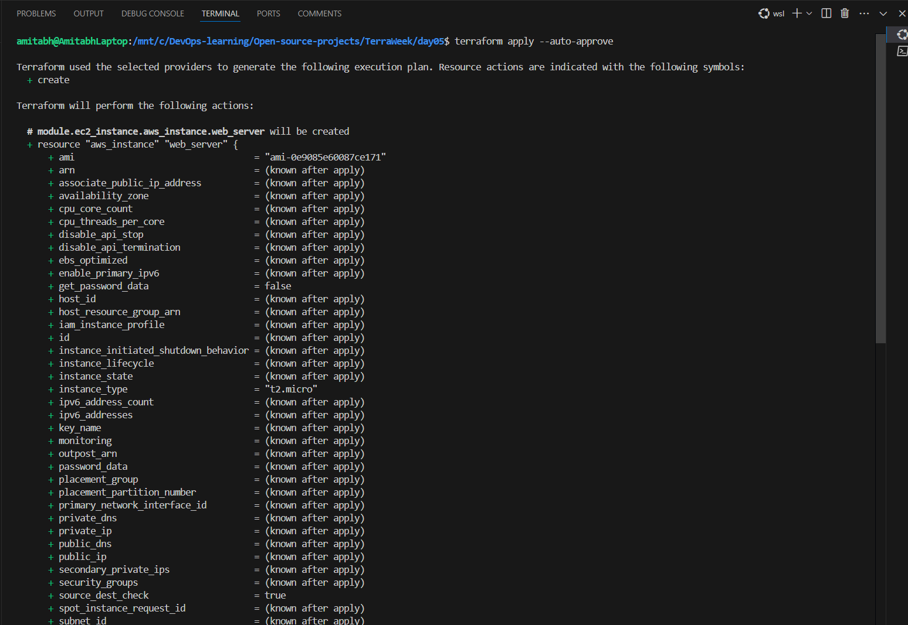
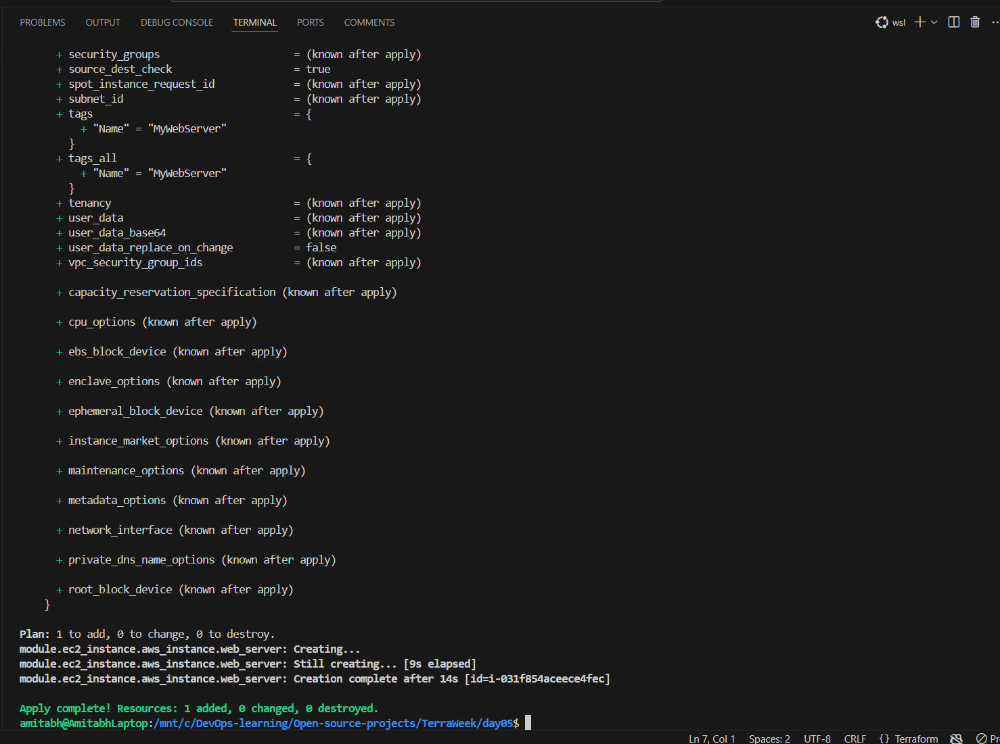
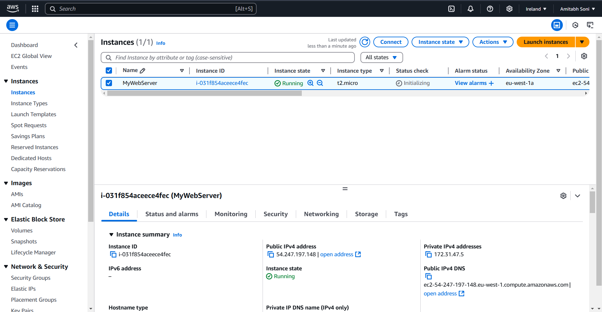
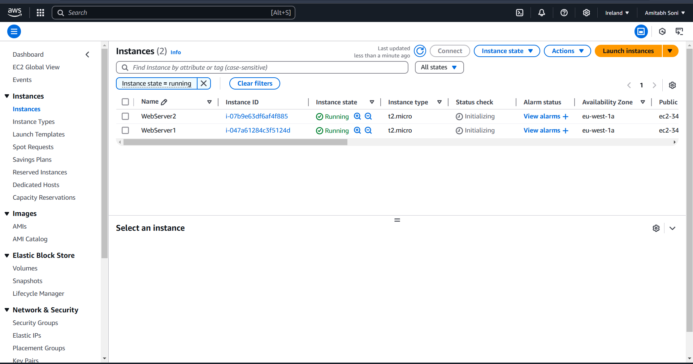

# TerraWeek Day 5

## Task 1: 

- What are **modules** in Terraform and why do we need modules in Terraform?

    - Modules in Terraform are containers for multiple resources that are used together. They are a way to organize and encapsulate reusable infrastructure code.

    **Why We Need Modules:**

    * **Reusability:** Write the code once and reuse it across different projects or environments
    * **Consistency:** Standardize infrastructure components to ensure uniform deployments
    * **Abstraction:** Simplify complex configurations by breaking them into manageable parts
    * **Scalability:** Create a modular architecture to scale deployments without rewriting existing code

- What are the benefits of using modules in Terraform?

    - Benefits of Using Modules:

        1. Easier Collaboration: Teams can work on individual modules without interfering with others
        2. Version Control: Track changes to modules and roll back to previous versions if needed
        3. Reduced Errors: Standardized modules decrease the chances of configuration errors
        4. Faster Development: Modules save time when deploying similar infrastructure repeatedly

## Task 2: 
- Create/Define a module in Terraform to encapsulate reusable infrastructure configuration in a modular and scalable manner. For e.g. $\textcolor{yellow}{\textsf{EC2 instance in AWS}}$, $\textcolor{lightblue}{\textsf{Resource Group in Azure}}$, $\textcolor{red}{\textsf{Cloud Storage bucket in GCP}}$.

    - for this you can use `main.tf` and `terraform.tf` and directory `terraform-infra`

    - Your tree structure should look like: 
    
        ```bash
        day05
        ├── main.tf
        ├── terraform.tf
        ├── terraform-infra
        │   ├── ec2.tf
        │   ├── output.tf
        │   └── variable.tf
        ```

    - After getting this structure you can run following terraform commmand(from day05 path)

        1. `terraform init` : Initialize Terraform

            

        2. `terraform plan` : Review the Terraform plan

            

            

        3. `terraform apply --auto-approve` : Apply the changes

            

            

        4. Instance created image : 

            


## Task 3: 
- Dig into **modular composition** and **module versioning**.

1. **Modular Composition:**
    - Modular composition allows you to nest modules and create hierarchical structures. For example:

    - Update your `main.tf` and `output.tf` with below provided code and run all terraform command to see output, whether the Modular Composition is working or not 

    - Properly see `main.tf` for **Modular Composition**

    - Final output of EC2 instances : 

        


    ### `main.tf`

    ```hcl
    # Root module
    module "ec2_instance1" {
        source         = "./terraform-infra"
        ami_id         = "ami-0e9085e60087ce171"
        instance_type  = "t2.micro"
        instance_name  = "WebServer1"
    }

    module "ec2_instance2" {
        source         = "./terraform-infra"
        ami_id         = module.ec2_instance1.ami_id
        instance_type  = module.ec2_instance1.instance_type
        instance_name  = "WebServer2" # Different name to distinguish instances
    }

    output "instance1_public_ip" {
        value = module.ec2_instance1.public_ip
    }

    output "instance2_public_ip" {
        value = module.ec2_instance2.public_ip
    }
    ```

    ### `output.tf`

    ```hcl
    output "instance_id" {
        description = "The ID of the EC2 instance"
        value       = aws_instance.web_server.id
    }

    output "public_ip" {
        description = "The public IP address of the EC2 instance"
        value       = aws_instance.web_server.public_ip
    }

    output "ami_id" {
        description = "The AMI ID used for the EC2 instance"
        value       = var.ami_id
    }

    output "instance_type" {
        description = "The instance type of the EC2 instance"
        value       = var.instance_type
    }

    output "instance_name" {
        description = "The name tag of the EC2 instance"
        value       = var.instance_name
    }
    ``` 


2. **Module Versioning:**

   - Modules can be versioned when sourced from a registry or a version-controlled repository like GitHub. For example:
     ```hcl
     module "s3_bucket" {
       source  = "terraform-aws-modules/s3-bucket/aws"
       version = "3.0.0"
     }
     ```


## Task 4: 
- What are the ways to **lock Terraform module versions**? Explain with code snippets.

    **Why Lock Module Versions?**
    To ensure consistent deployments and prevent breaking changes when the module is updated.

    **Ways to Lock Versions:**
    1. **Specify a Fixed Version:**
       ```hcl
       module "example" {
         source  = "terraform-aws-modules/vpc/aws"
         version = "2.78.0"
       }
       ```

    2. **Specify a Version Range:**
       ```hcl
       module "example" {
         source  = "terraform-aws-modules/vpc/aws"
         version = "~> 2.0"
       }
       ```
       - This allows patch updates but not major updates.

    3. **Git Repository with Commit Hash:**
       ```hcl
       module "example" {
         source = "git::https://github.com/example/module.git?ref=abc123"
       }
       ```

    4. **Git Tag or Branch:**
       ```hcl
       module "example" {
         source = "git::https://github.com/example/module.git?ref=v1.0.0"
       }
       ```

    ---


[Linkedin](https://www.linkedin.com/in/amitabh-devops/)


